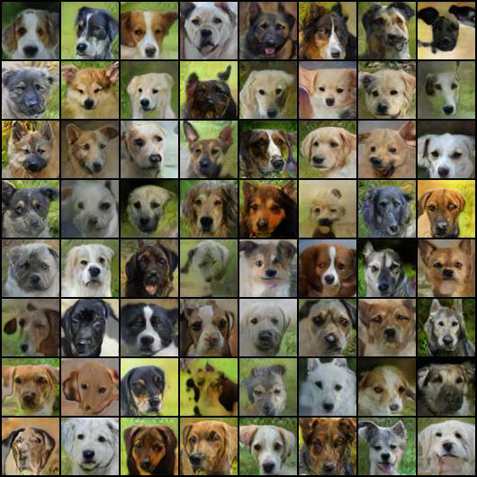
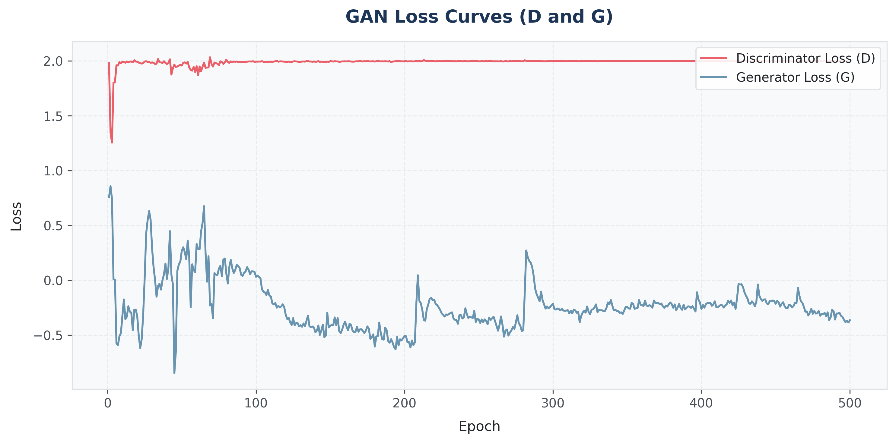
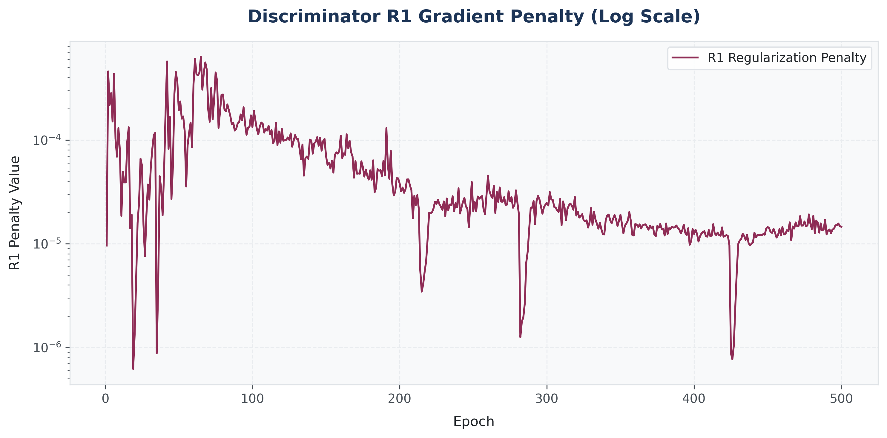
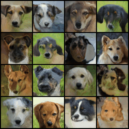

# Gog-Gan: Unconditional Dog Face Generation

A high-fidelity, unconditional Generative Adversarial Network (GAN) trained to generate realistic $64\times64$ dog faces on the AFHQ Dog dataset. The architecture leverages spectral normalization, self-attention blocks, differentiable augmentations (DiffAugment), and mixed-precision (bfloat16) acceleration.

---

## 📸 Generated Results (Epoch 500)
Below is a grid of 64 unique dog faces generated by the model using Exponential Moving Average (EMA) weights at the final epoch:



---

## 📈 Training Analytics & Metrics

### 1. Adversarial Loss Curves (D & G)
The model was trained for 500 epochs. After resolving a late-stage collapse around epoch 225 by halving the learning rates (`lr_g = 5e-5`, `lr_d = 2e-4`), the training stabilized into a clean Nash Equilibrium where the Discriminator loss hovered consistently around **2.0** and the Generator loss hovered around **-0.3**:



> [!NOTE]
> **Why is the Discriminator Loss flat at exactly 2.0?**  
> This is a normal mathematical property of the Hinge Loss function when training is stable.  
> 
> The loss formula is:  
> $$L_D = \text{ReLU}(1.0 - D(\text{real})) + \text{ReLU}(1.0 + D(\text{fake}))$$  
> 
> When the generator produces high-fidelity images that fool the discriminator, the discriminator scores for real and fake images converge to the same value ($D(\text{real}) \approx D(\text{fake}) = s$).  
> 
> As long as these scores stay within $[-1, 1]$ (enforced by Spectral Normalization), the ReLUs remain active, and the terms cancel out:  
> $$L_D \approx (1.0 - s) + (1.0 + s) = 2.0$$

### 2. Discriminator R1 Gradient Penalty
To ensure training stability, we applied R1 gradient penalty regularization. The penalty was kept extremely small and stable (in the $10^{-5}$ range), preventing gradient explosion:



---

## 📊 Metrics Summary

| Metric | Minimum | Maximum | Final Value (Epoch 500) | Stable Average |
| :--- | :--- | :--- | :--- | :--- |
| **Discriminator Loss** | 1.2552 | 2.0334 | 1.9983 | 1.9965 |
| **Generator Loss** | -0.8451 | 0.8577 | -0.3629 | -0.3200 |
| **R1 Penalty** | $9.58 \times 10^{-6}$ | $6.36 \times 10^{-4}$ | $1.45 \times 10^{-5}$ | $2.20 \times 10^{-5}$ |
| **FID Score (2048 samples)** | — | — | **25.1106** | — |
| **Inception Score (2048 samples)** | — | — | **6.5519 ± 0.3451** | — |
| **VRAM Usage** | 10.58 GB | 10.59 GB | 10.59 GB | 10.59 GB |
| **System RAM** | 4.24 GB | 4.38 GB | 4.31 GB | 4.30 GB |

---

## 🛠️ Architecture Details

* **Generator V2:** Features custom upsampling blocks, spectral normalization, and self-attention layers at $32\times32$ feature maps to capture long-range spatial dependencies.
* **Discriminator V2:** A downsampling network utilizing spectral normalization and differentiable augmentations (color, translation, cutout) to prevent discriminator overfitting.
* **Mixed Precision:** Uses `bfloat16` training autocast for rapid training and reduced VRAM footprint.

---

## 🚀 How to Run

### 1. Installation
Clone the repository and install dependencies:
```bash
pip install -r requirements_train.txt
```

### 2. Training
To train the model from scratch:
```bash
python3 dog_gan_train.py --epochs 500 --batch_size 128 --image_size 64 --model_v2 --lr_g 5e-5 --lr_d 2e-4
```

To resume training from a checkpoint:
```bash
python3 dog_gan_train.py --resume --epochs 500 --batch_size 128 --image_size 64 --model_v2 --lr_g 5e-5 --lr_d 2e-4
```

### 3. Bonus
Here is a looping animation showing a 4x4 grid of 16 dog faces smoothly morphing through the Generator's 128-dimensional latent space:



To generate your own dog grids or smooth morphing animations:
1. Place your weights file named `epoch_0500.pt` in the repository root directory.
2. Generate a static 64-dog grid:
   ```bash
   python3 generate_final_samples.py
   ```
3. Generate the animated latent space morphing GIF:
   ```bash
   python3 interpolate_latent.py
   ```
   The resulting GIF will be saved to `generated_outputs/dog_morph_interpolation.gif`.
